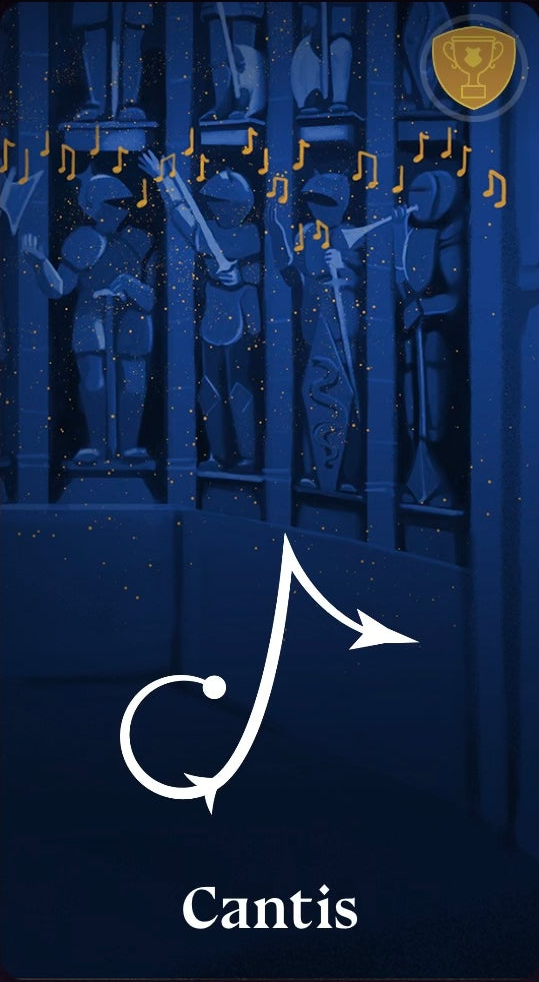
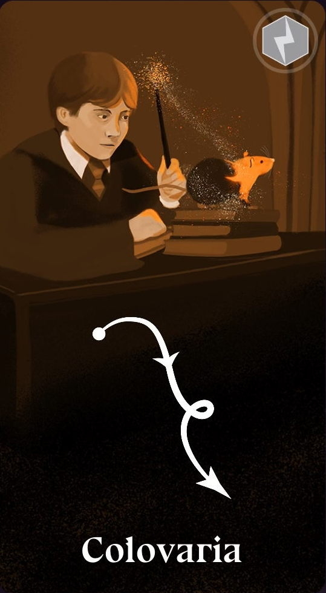
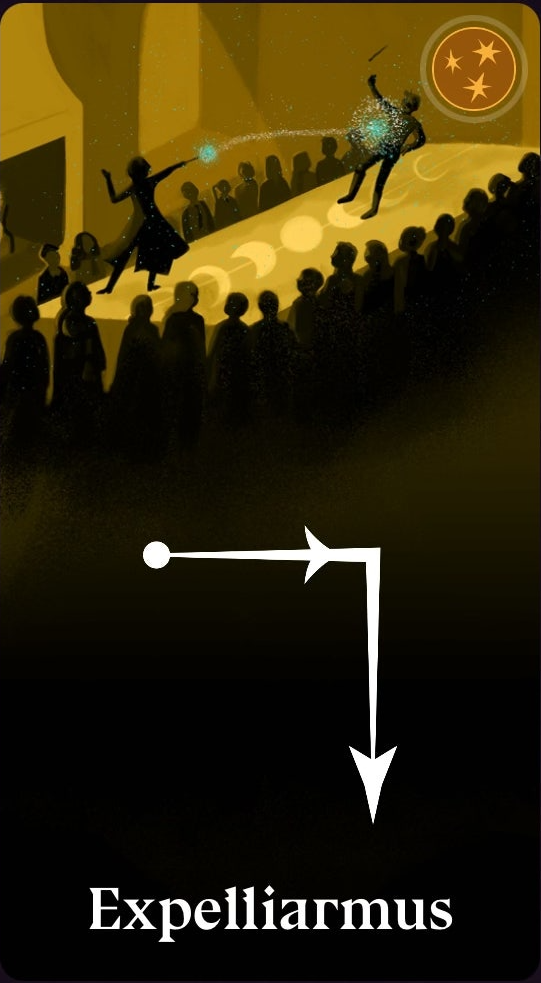
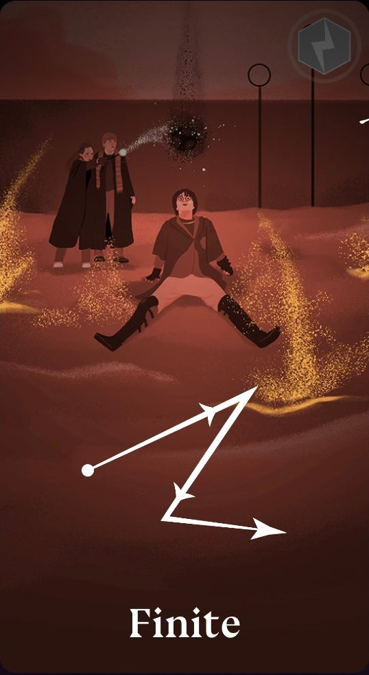
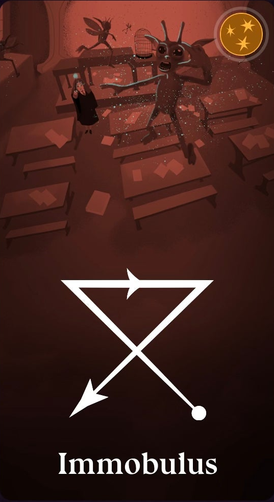
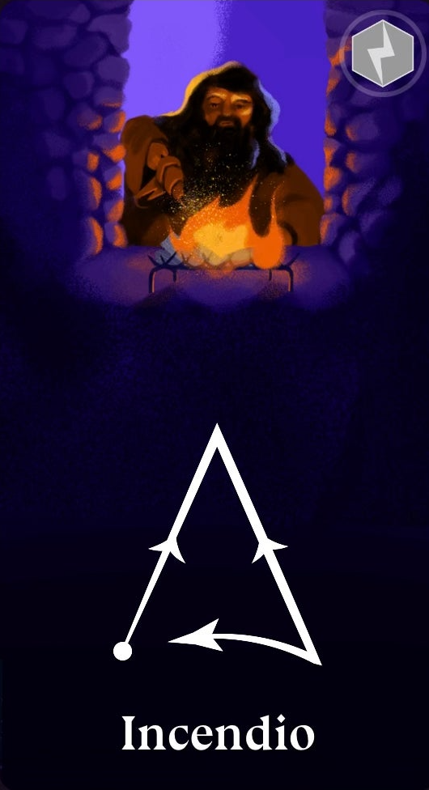
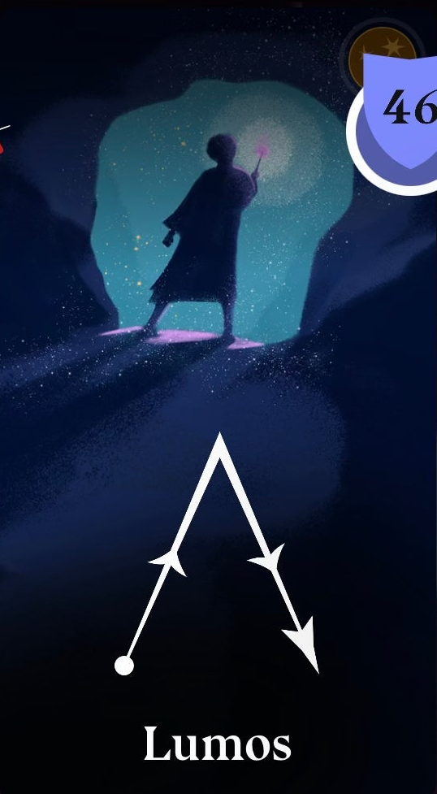
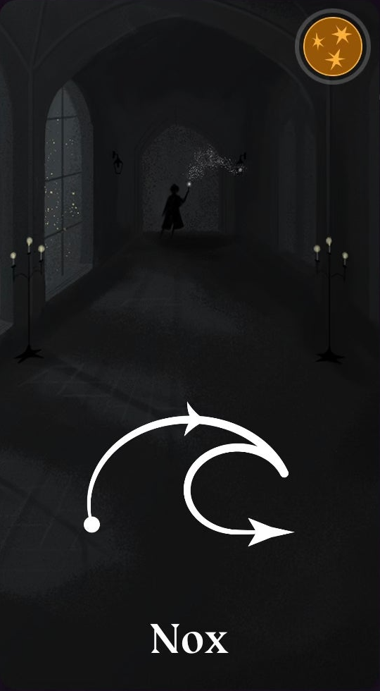
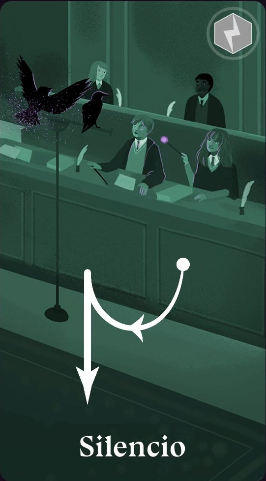

# hass-magic-caster-wand
Harry Potter: Magic Caster Wand Home Assistant Integration

<table>
  <tr>
    <td colspan="2" align="center">
      
    </td>
  </tr>
  <tr>
    <td align="center" valign="bottom">
      
      
<b>Turn on Device</b>

    </td>
    <td align="center" valign="bottom">
      
      
<b>Turn on Light</b>

    </td>
  </tr>
</table>

## 💬 Feedback & Support

🐞 Found a bug? Let us know via an [Issue](https://github.com/eigger/hass-magic-caster-wand/issues).  
💡 Have a question or suggestion? Join the [Discussion](https://github.com/eigger/hass-magic-caster-wand/discussions)!

## Supported Models
- Defiant
- Loyal
- Honourable

## Installation
1. Install this integration with HACS (adding repository required), or copy the contents of this
repository into the `custom_components/magic_caster_wand` directory.
2. Restart Home Assistant.

## Spells & Motions
>[!IMPORTANT]
>You must connect to the wand via Bluetooth(Switch) first in order to receive the spell values.

⬆ ⬇ ⬅ ➡ ⬈ ⬉ ⬊ ⬋
| Spell | Motion | Description |
|------|--------|-------------|
| Protego | ⬇ | Downward hand motion (arrow-like) |
| Serpensortia | ⬆ | Upward hand motion |
| Lumos | ⬅ ⬈ ⬊ | Draw a triangular motion: move left, then diagonally up to the right, then straight down |
| ... |  | If you know the spell motion or have an easier way to perform it, please share it here. |

## Spell Cards
<table>
  <tr>
    <td align="center"><b>Cantis</b> </td>
    <td align="center"><b>Colovaria</b> </td>
    <td align="center"><b>Expecto Patronum</b> </td>
    <td align="center"><b>Expelliarmus</b> </td>
  </tr>
  <tr>
    <td align="center"><b>Finite</b> </td>
    <td align="center"><b>Flagrate</b> </td>
    <td align="center"><b>Immobulus</b> </td>
    <td align="center"><b>Incendio</b> </td>
  </tr>
  <tr>
    <td align="center"><b>Lumos Maxima</b> </td>
    <td align="center"><b>Lumos</b> </td>
    <td align="center"><b>Meteolojinx</b> </td>
    <td align="center"><b>Nox</b> </td>
  </tr>
  <tr>
    <td align="center"><b>Salvio Hexia</b> </td>
    <td align="center"><b>Silencio</b> </td>
  </tr>
</table>

## References
- [Magic-Caster-Wand-Open-app-ai (whymaxwhy)](https://github.com/whymaxwhy/Magic-Caster-Wand-Open-app-ai.git)
- [OpenCaster (Blues-Hailfire)](https://github.com/Blues-Hailfire/OpenCaster.git)
